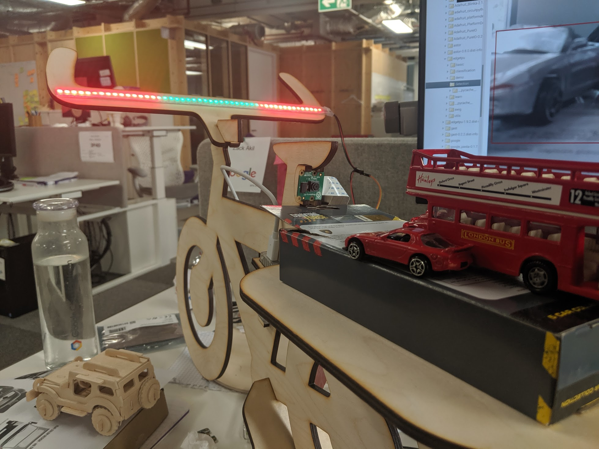

# Edge TPU Safe Bike
An application of realtime object-detection running on an Edge TPU for making cycling in busy cities a little less terrifying.

## Watch the video of the PyData talk [here](https://www.youtube.com/watch?v=UmDeKDgFRj4)

## Parts
- [Raspberry Pi 4](https://www.raspberrypi.org/products/raspberry-pi-4-model-b/)
- [Raspberry Pi Camera Module V2](https://www.raspberrypi.org/products/camera-module-v2/)
- [Neo Pixel LED Strip](https://www.adafruit.com/product/1506)
- [Coral Edge TPU USB Accelerator](https://coral.withgoogle.com/products/accelerator/)
